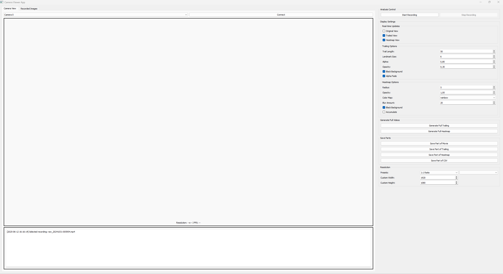

# Hand Movement Analysis and Visualization Tool

A powerful application for analyzing and visualizing hand movements in video recordings. This tool provides real-time hand tracking, movement trail visualization, and heatmap generation capabilities.

## Visual Demonstrations

### Main Interface

*Main application interface with controls and visualization*


*Secondary interface view with additional controls*

### Visualization Types

#### Trailing Effect

*Hand movement trails showing motion paths with customizable fade effects*

[View Demo](docs/demos/trailing/demo.mp4)

#### Heatmap Generation

*Heat intensity map showing movement concentration areas*

[View Demo](docs/demos/heatmap/demo.mp4)

### Real-time Analysis

*Real-time hand tracking and analysis*


*Alternative view of real-time tracking*

## Features

- **Real-time Hand Tracking**
  - Accurate hand landmark detection
  - Support for multiple hands
  - Live camera preview

- **Movement Visualization**
  - Trailing effect with customizable parameters
  - Heatmap generation with various color schemes
  - Adjustable opacity and blending options

- **Video Management**
  - Record from camera
  - Import existing videos
  - Export full or partial visualizations
  - Save analysis data in CSV format

- **User-friendly Interface**
  - Intuitive controls
  - Real-time preview
  - Customizable settings
  - Progress tracking

## Quick Start

1. Install dependencies:
```bash
pip install -r requirements.txt
```

2. Run the application:
```bash
python main.py
```

For detailed instructions, see [Installation Guide](INSTALL.md)

## Documentation

- [Technical Documentation](TECHNICAL.md) - Detailed project structure and implementation details
- [Installation Guide](INSTALL.md) - Setup instructions and usage examples

## Project Structure

```
hands/
├── src/
│   ├── core/          # Core application logic
│   ├── data/          # Data processing and storage (git-ignored)
│   ├── gui/           # User interface components
│   ├── managers/      # System management modules
│   └── utils/         # Utility functions
└── docs/              # Documentation resources
    ├── screenshots/   # Interface and feature screenshots
    │   ├── main_interface.png
    │   ├── second_tab_interface.png
    │   ├── trailing_demo.png
    │   ├── heatmap_demo.png
    │   ├── real_time_demo.png
    │   └── real_time_demo_v2.png
    └── demos/         # Feature demonstration videos
        ├── trailing/  # Trailing effect demos
        ├── heatmap/   # Heatmap visualization demos
        └── realtime/  # Real-time analysis demos
```

See [Technical Documentation](TECHNICAL.md) for detailed structure.

## Requirements

- Python 3.8+
- OpenCV with contrib modules
- PyQt5
- Other dependencies listed in requirements.txt

## Acknowledgments

- MediaPipe for hand tracking technology
- OpenCV community for computer vision tools
- PyQt team for GUI framework
